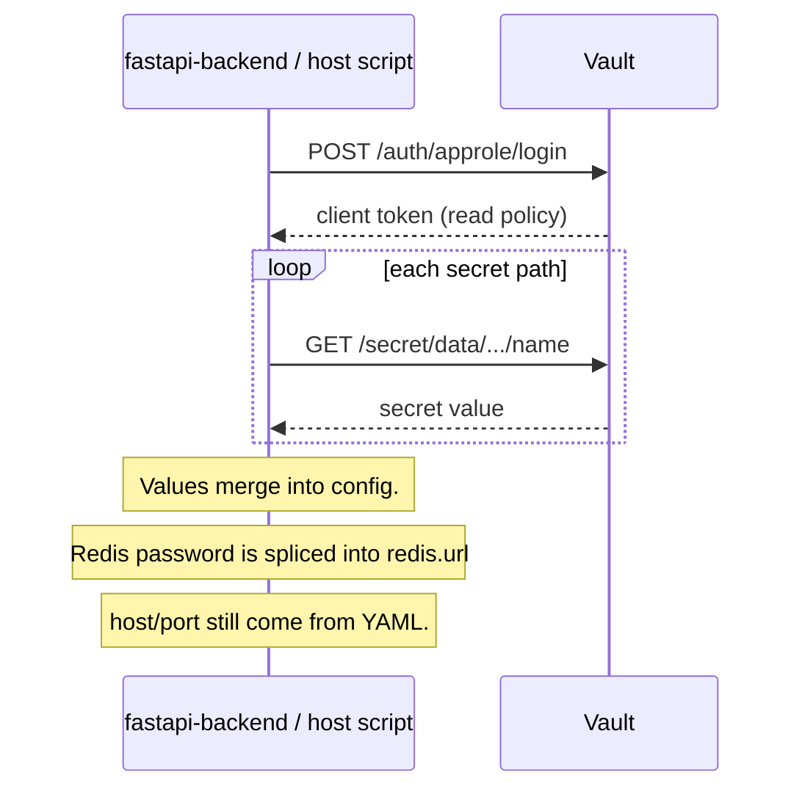
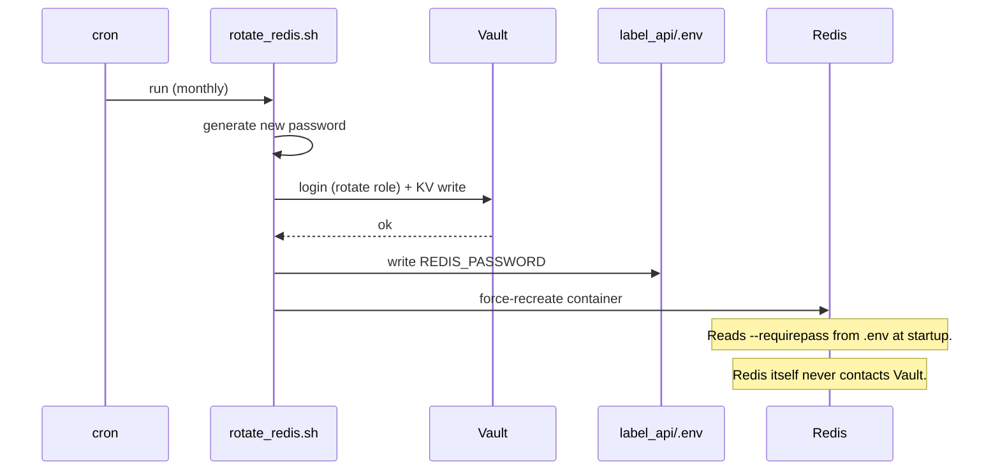
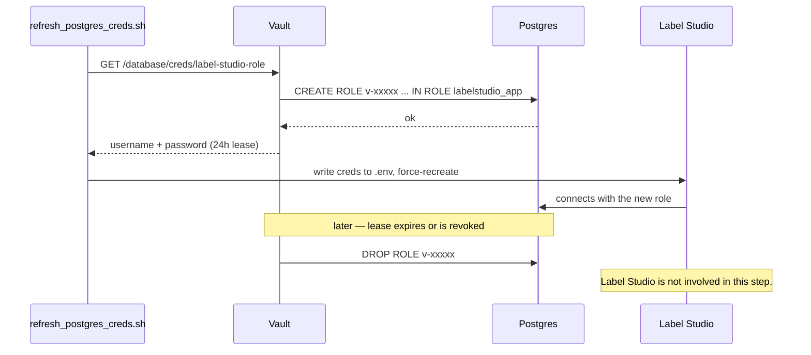

# How secrets move between Vault and its consumers

Vault is the source of truth for every credential in this stack, but most of the
services that use those credentials (Redis, Label Studio) never talk to Vault
directly — they're unmodified third-party images with no Vault awareness. Only
a small set of identities ever open a connection to Vault's API: `fastapi-backend`,
host-side scripts running on vostok, and the `ops/vault/*.sh` rotation scripts.
Everything else is fed credentials indirectly, through files and container
restarts.

This matters for exposure: Vault's port is reachable beyond localhost (so the
other cross-network app can reach it too), but the number of things that
actually *need* to authenticate against it is small and each identity's Vault
policy is scoped to only the secret paths it needs.

## Flow 1 — direct fetch (fastapi-backend, host scripts)

Both `fastapi-backend` and the host-side CLI scripts (`utilities/`,
`data_download/`, etc.) go through the same code path: `load_app_config()` in
`config/app_config.py`, which calls out to `config/vault_client.py`. This
happens once, at process start — there's no persistent connection or live
refresh afterward.

If Vault is unreachable at startup, the login or read calls fail, `vault_client.py`
catches it, logs a warning, and `load_app_config()` falls back to whatever's
already in the local `.env.yaml`/`override.env.yaml` — the app still starts.

`role_id` is non-secret config; `secret_id` is delivered once as a
locally-stored, chmod-600 file mounted into the container (or present on disk
for host scripts) — never committed to git.

## Flow 2 — indirect: Redis and Label Studio (rotation-script mediated)

Redis and Label Studio don't run any Vault client code. A rotation script,
run by an operator or cron, does the Vault round-trip on their behalf and then
hands the result off the old-fashioned way: an env file plus a container
restart.

`refresh_postgres_creds.sh` follows the same shape for Label Studio, except
the value it writes doesn't come from a static KV secret — it's freshly
*generated* by Vault on every run (see Flow 3).

## Flow 3 — Postgres dynamic credentials (Vault ↔ Postgres, app not involved)

Postgres is the one backend with a real dynamic-secrets engine. Vault holds
its own admin credential for Postgres and mints/drops short-lived roles
directly — no static Postgres password exists in this flow at all.

`default_ttl=24h` / `max_ttl=72h` — Label Studio holds a persistent connection
pool and can't re-fetch mid-lease, so `refresh_postgres_creds.sh` runs hourly
(well inside the TTL window) rather than relying on the lease alone.

## Who actually talks to Vault

| Identity | AppRole | Talks to Vault? |
|---|---|---|
| `fastapi-backend` | `literature-annotator` (read-only) | Yes — once at startup |
| host-side scripts (`utilities/`, `data_download/`, ...) | `literature-annotator` (read-only) | Yes — once per invocation |
| `ops/vault/*.sh` rotation scripts | `literature-annotator-rotate` (read+write) | Yes — on each scheduled run |
| Redis | — | No |
| Label Studio | — | No |
| Postgres | — | No (Vault connects *to* it as an admin) |
| the other cross-network app | needs its own read-only AppRole, scoped to the `redis` path | Yes — Vault's port is reachable off-host for exactly this |
